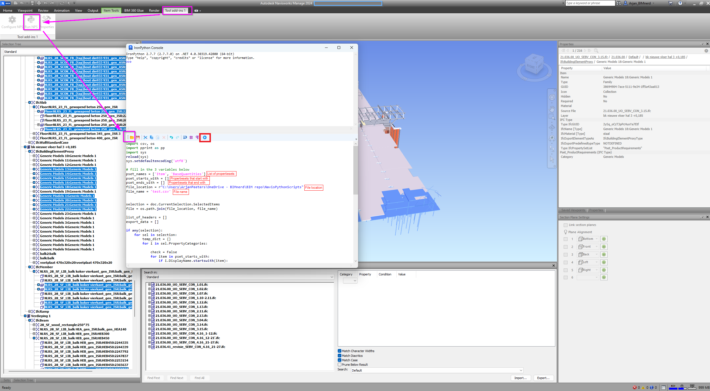

# Workflow of get Psets in csv script

1 - Select in Navisworks all elements that you wish to export the data from

2 - Then open the plugin (see readme about installing in root folder)

3 - load this script

4 - Than make shure to use at least one of the posibilities to input Propertiesets:

    pset_names <- straight input a list of popertieset names
    pset_starts_with <- search for propertiesets that start with a certain string
    pset_ends_with <- search for propertiesets that end with a certain string

5 - Fill in the file_loaction 

6 - fill in the file name

7 - press the run icon

8 - Enjoy all the data in a csv file.

